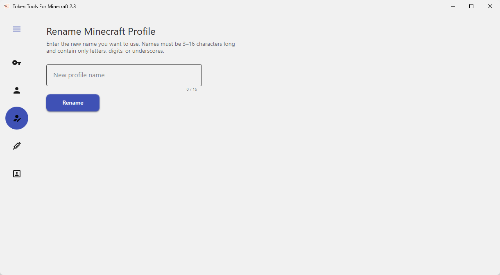

<div align="center">


<br/>

# 🐖 ALTs Tools

#### 更优雅的 Minecraft 多账号（ALT）管理工具

<p>一站式完成 <b>令牌转换</b> · <b>账号管理</b> · <b>改名</b> · <b>注入</b> · <b>皮肤更换</b></p>

<br/>

<a href="LICENSE"></a>


<br/>
<br/>

<a href="#-功能一览">功能</a> ·
<a href="#️-界面预览">预览</a> ·
<a href="#-构建与运行">构建</a> ·
<a href="#-快速上手">上手</a> ·
<a href="#-技术栈与依赖">依赖</a>

<sub><a href="README.md">English</a> · <b>简体中文</b></sub>

<sub>Original by <a href="https://github.com/NoobCock/RefreshToAccess2">NoobCock</a></sub>

</div>

---

## ✨ 这是什么

**ALTs Tools**（程序内名为 *Token Tools For Minecraft*）是一款为 Minecraft 玩家打造的多账号（ALT）一体化管理工具。

把一串 Refresh Token 丢进来，它会帮你换成可用的 Access Token、登录账号、把档案整理成漂亮的卡片，还能直接给正在运行的游戏「换上」这个账号，甚至顺手把皮肤也换了。

整个界面基于 **WPF + .NET 8**，采用 **MaterialDesign** 主题，配上会缓缓流动的 **Minecraft 全景背景** 与流畅的导航动画 —— 既好看，又顺手。

> [!WARNING]
> 仅供学习交流与个人账号管理使用。请勿用于任何违反 Minecraft / Mojang / Microsoft 服务条款的行为，使用风险自负。

---

## 🚀 功能一览

<table>
<tr>
<td width="50%" valign="top">

### 🔑 Converter · 令牌转换
把 **Refresh Token** 一键换成 **Access Token** 并完成登录。

- 内置多种启动器客户端身份：
  `Vanilla` · `HMCL` · `PCL` · `Essential` ·
  `ksyz Alt Manager` · `BakaXL` · `LabyMod` 等
- 支持 **自定义 Client ID**
- 可选 **自动复制** 转换后的令牌
- 实时显示玩家名与 UUID

</td>
<td width="50%" valign="top">

### 🗂️ Alt Manager · 账号管理
把所有 ALT 账号集中成可视化卡片墙。

- **卡片 / 列表** 两种视图自由切换
- **搜索 + 排序**（按时间、按名称）
- 玩家头像缓存，加载更快
- 批量 **多选** 操作
- 点击查看账号详情面板

</td>
</tr>
<tr>
<td width="50%" valign="top">

### ✏️ Renamer · 游戏内改名
直接修改游戏内昵称（IGN）。

- 调用官方 Minecraft 接口改名
- 需先在 Converter 完成登录
- 改名结果即时反馈

</td>
<td width="50%" valign="top">

### 💉 Injector · 令牌注入
把账号「注入」到正在运行的 Minecraft。

- 自动识别运行中的游戏进程
- 免重启切换登录账号
- 通过本地通道安全下发令牌

</td>
</tr>
<tr>
<td colspan="2" valign="top">

### 🎨 Skin Changer · 皮肤更换
在线预览并更换皮肤，所见即所得。

- **3D 皮肤实时预览**（基于 Direct3D 渲染） · 支持 `Classic` / `Slim` 两种模型
- 可按 **玩家名** 查询并套用他人皮肤 · 多套 Minecraft 版本全景背景任意切换

</td>
</tr>
</table>

---

## 🖼️ 界面预览

<div align="center">

<table>
<tr>
<td align="center" width="50%">

<br/><b>🔑 Token Converter · 令牌转换</b>
<br/><sub>双栏粘贴令牌，顶部切换客户端，可开启自动复制</sub>
</td>
<td align="center" width="50%">

<br/><b>🗂️ Alt Manager · 账号详情</b>
<br/><sub>查看 UUID 与令牌，支持刷新令牌 / 一键复制</sub>
</td>
</tr>
<tr>
<td align="center" width="50%">

<br/><b>🗂️ Alt Manager · 卡片视图</b>
<br/><sub>头像墙一目了然，支持搜索与导入</sub>
</td>
<td align="center" width="50%">

<br/><b>🗂️ Alt Manager · 列表视图</b>
<br/><sub>一键切换，紧凑展示更多账号</sub>
</td>
</tr>
<tr>
<td align="center" width="50%">

<br/><b>✏️ Renamer · 游戏内改名</b>
<br/><sub>输入新昵称即可一键改名</sub>
</td>
<td align="center" width="50%">

<br/><b>💉 Injector · 令牌注入</b>
<br/><sub>选择运行中的游戏进程注入账号</sub>
</td>
</tr>
</table>

<br/>


<br/><b>🎨 Skin Changer · 皮肤更换</b>
<br/><sub>带 Minecraft 全景背景的 3D 实时皮肤预览，可按玩家名查询并套用</sub>

</div>

---

## 📦 环境要求

| 用途 | 需求 |
| --- | --- |
| 🟢 运行已编译版本 | Windows 10 / 11 + [.NET 8 Desktop Runtime](https://dotnet.microsoft.com/download/dotnet/8.0) |
| 🔨 从源码编译 | [.NET 8 SDK](https://dotnet.microsoft.com/download/dotnet/8.0) 或 Visual Studio 2022+ |

---

## 🔧 构建与运行

```powershell
# 1. 克隆仓库
git clone https://github.com/NoobCock/RefreshToAccess2.git
cd RefreshToAccess2

# 2. 还原依赖并编译
dotnet restore
dotnet build -c Release

# 3. 运行
dotnet run --project RefreshToAccess2
```

编译产物为 **`TokenTools.exe`**，位于：

```
RefreshToAccess2/bin/Release/net8.0-windows/
```

> [!TIP]
> 也可以直接用 **Visual Studio 2022**（或更新版本）打开 `RefreshToAccess2.slnx` 一键编译运行。

---

## 🧭 快速上手

1. 打开 **Converter**，粘贴 Refresh Token，选择对应客户端，点击转换完成登录。
2. 在 **Alt Manager** 中查看、搜索、整理你的所有账号。
3. 需要改名时进入 **Renamer**（需已在 Converter 登录）。
4. 启动 Minecraft 后，在 **Injector** 中把账号注入游戏进程，免重启切换。
5. 在 **Skin Changer** 中预览并更换皮肤。

---

## 🧱 技术栈与依赖

| 依赖 | 用途 |
| --- | --- |
| [MaterialDesignThemes](https://github.com/MaterialDesignInXAML/MaterialDesignInXamlToolkit) | Material 风格 UI 主题 |
| [Newtonsoft.Json](https://www.newtonsoft.com/json) | JSON 序列化 / 反序列化 |
| [System.IdentityModel.Tokens.Jwt](https://learn.microsoft.com/dotnet/api/system.identitymodel.tokens.jwt) | JWT 令牌解析 |
| [Vortice.Direct3D11 / D3DCompiler](https://github.com/amerkoleci/Vortice.Windows) | 3D 皮肤预览渲染 |
| [EasyCompressor.LZMA](https://github.com/mjebrahimi/EasyCompressor) | 内嵌资源压缩 |
| System.Management | 进程信息查询（注入用） |

---

## 📄 许可证

本项目基于 [GNU General Public License v3.0](LICENSE.txt) 开源发布。

## 🙌 致谢

原始项目由 [**NoobCock**](https://github.com/NoobCock/RefreshToAccess2) 创建，本仓库在其基础上修改与完善。

<div align="center">
<sub>如果这个项目对你有帮助，欢迎点一个 ⭐ Star</sub>
</div>
